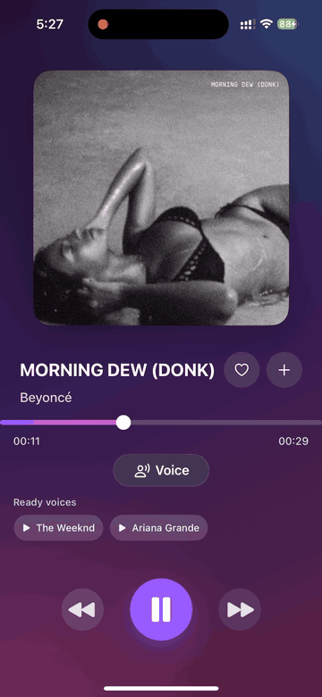

# Beam Music iOS

Beam Music iOS is an AI voice-conversion music player prototype. Users can discover and play tracks, choose an AI voice, and request either a short preview conversion or a full-track conversion.

> The iOS app is not publicly distributed because of artist voice rights, music licensing, App Store review, and related legal contact-risk concerns. The working demo can be reviewed through the deployed web demo.

- Web demo: https://beam-music.kimjiha1112.chatgpt.site
- iOS demo video: [full video](docs/assets/beam-ios-demo.mov)

## Demo Preview

[](docs/assets/beam-ios-demo.mov)

## Implementation Summary

- SwiftUI-based iOS application UI
- Feature-scoped state management with The Composable Architecture(TCA)
- Login, sign-up, and onboarding flow
- Home music discovery with trending/search-based track lists
- Main player, mini player, playback controls, and track navigation
- AI voice selection, preview conversion, and full-track conversion requests
- Converted song persistence and `Songs I Converted` library view
- User playlist listing, creation, detail view, and add-to-playlist flow
- Voice Conversion Provider abstraction for Beam SVC server integration
- Pre-conversion manager for proactive conversion, resume, and caching
- Network and low-power-mode based warmup control

## Architecture

```text
Beam-iOS
  |
  | 1. login, playlists, converted songs, metadata
  v
beam-svc-server / app API
  |
  | 2. voice list, voice conversion, async job status
  v
RVC-based SVC pipeline
  |
  | 3. converted audio result
  v
Beam-iOS Player / Library

beam-music-web-demo
  |
  | deployed browser demo for public review
  v
same deployed Beam backend and SVC flow
```

The iOS app reads `BEAM_API_BASE_URL` and `BEAM_SVC_BASE_URL` from the runtime environment or `Info.plist`, then falls back to development defaults when no configured value exists. Voice conversion call sites are isolated behind the `VoiceConversionProvider` protocol so the app is not tightly coupled to a specific vendor or backend implementation.

## iOS App Structure

```text
BeamApp/
├── App/                       # App entry point and asset catalog
├── DataFlow/                  # AppReducer
├── Feature/
│   ├── Home/                  # Music discovery, trending, search, playback start
│   ├── Player/                # Main player, AI/REMIX toggle, voice conversion
│   ├── MiniPlayer/            # Bottom mini player
│   ├── Library/               # Playlists and converted tracks
│   ├── Playlist/              # Playlist detail
│   ├── LoginFeature/          # Login, sign-up, onboarding
│   ├── Conversion/            # Pre-conversion, warmup, cache/job state
│   ├── Setting/               # User settings
│   └── Tab/                   # Tab navigation
├── Network/
│   ├── Endpoints.swift        # API base URLs and endpoint definitions
│   ├── APIClient.swift        # Server API calls
│   ├── VoiceConversionClient.swift
│   ├── AudiusService.swift
│   └── DTO/                   # API DTOs
├── AudioProcessing/           # Audio playback/processing manager
├── DesignSystem/              # Buttons, navigation, text/color styles
├── Security/                  # Keychain
└── Database/                  # Token and local storage models
```

## Core Features

### Music Discovery And Playback

- Search and trending track discovery through Audius API and Apple/iTunes preview URLs
- Playback, pause, previous/next track control through `AudioManager`
- Shared playback state between the main player and mini player
- Album art, progress, and playback-state UI

### AI Voice Conversion

- Fetches the available voice list from the server
- Converts the current track preview segment with the selected voice
- Requests full-track conversions as async jobs and displays progress/stage state
- Synchronizes conversion results with local records and server-side converted song lists
- Plays converted results from the `Songs I Converted` view

### Pre-conversion / Warmup

- Proactively converts the current or next track to reduce TTFAT(Time To First AI Track)
- Allows warmup only on Wi-Fi or wired network when low-power mode is disabled
- Prevents duplicate work for track/voice pairs that already have converted results
- Resumes pending jobs and syncs server state after app restart

### User And Library

- Login, sign-up, and onboarding screens
- User playlist fetch and creation
- Playlist detail track fetch and playback
- Add current player track to a playlist

## Beam SVC Integration

The iOS app uses the following Beam SVC server APIs.

```text
GET  /ai-convert/health
GET  /ai-convert/voices
POST /ai-convert/voice-conversion
GET  /ai-convert/jobs/:jobId
```

Short preview conversion receives audio bytes synchronously and plays them directly. Longer full-track conversion uses async jobs with `return_job=true`. See [docs/BEAM_SVC_API_SPEC.md](docs/BEAM_SVC_API_SPEC.md) for API details.

## Deployment And Demo Policy

- `beam-svc-server` provides the GPU-backed RVC/SVC pipeline.
- `beam-music-web-demo` is deployed as the public browser demo.
- The iOS app is not publicly distributed because of rights and review risks; app behavior can be reviewed through the demo video and web demo.

Public review links:

- Web demo: https://beam-music.kimjiha1112.chatgpt.site
- iOS demo video: [full video](docs/assets/beam-ios-demo.mov)

## Development Environment

- Xcode 15 or newer
- iOS 16 or newer
- Swift 5.9 or newer

Open the project:

```bash
open BeamApp.xcodeproj
```

Resolve Swift Package dependencies:

```bash
swift package resolve
```

## Environment Configuration

The app reads the following values from the runtime environment or `Info.plist`.

```text
BEAM_API_BASE_URL
BEAM_SVC_BASE_URL
JAMENDO_CLIENT_ID
```

Example:

```text
BEAM_API_BASE_URL=http://127.0.0.1:8080
BEAM_SVC_BASE_URL=http://127.0.0.1:8081
```

Do not commit API keys or external service tokens to the repository.

## Related Docs

- [docs/BEAM_SVC_API_SPEC.md](docs/BEAM_SVC_API_SPEC.md)
- [docs/BEAM_SVC_PIPELINE_DESIGN.md](docs/BEAM_SVC_PIPELINE_DESIGN.md)
- [docs/SVC_MIGRATION.md](docs/SVC_MIGRATION.md)
- [docs/remote-svc-deployment.md](docs/remote-svc-deployment.md)
- [docs/2026-06-24-preconversion-api-plan.md](docs/2026-06-24-preconversion-api-plan.md)

## License

This project is licensed under the MIT License.
